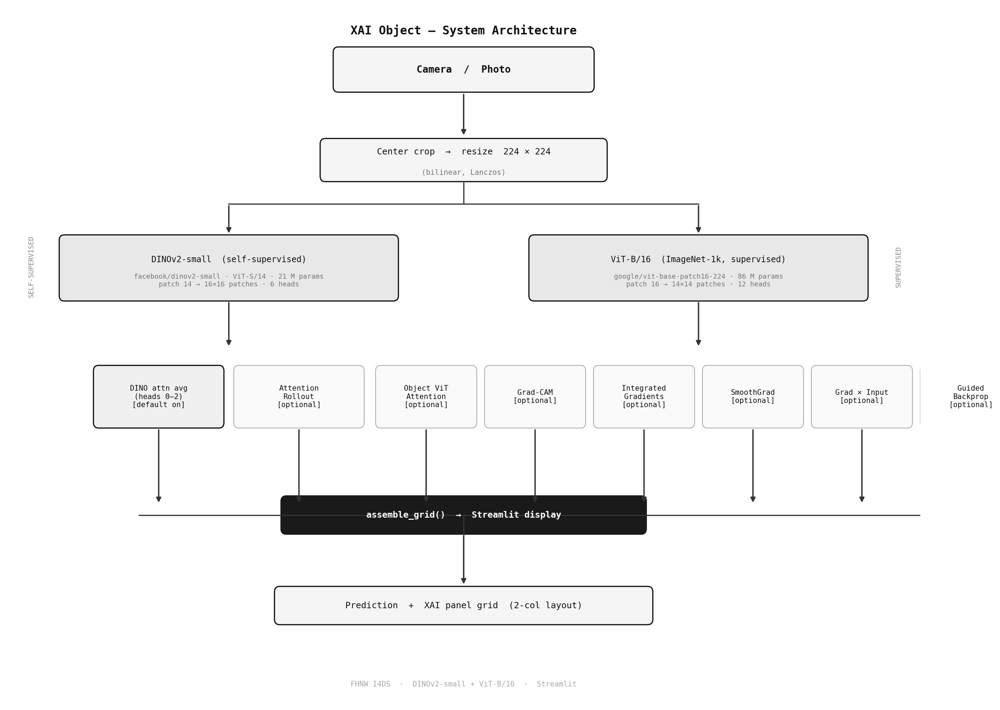

# XAI Object Lab

**Multi-method, real-time explainability showcase for image object recognition.**

Built for the FHNW I4DS XAI Lab. Runs eight fundamentally different explanation
methods side-by-side on a live webcam stream or uploaded photo, using a pair of
ViT-based models — one self-supervised, one supervised — to contrast what each
paradigm reveals.

---

## Architecture



A raw frame is center-cropped to a square and resized to 224 × 224. That single
tensor is then passed to two parallel model branches:

| Branch | Model | Role |
|---|---|---|
| Self-supervised | `facebook/dinov2-small` — ViT-S/14, 21 M params, 6 heads | Attention without label supervision |
| Supervised | `google/vit-base-patch16-224` — ViT-B/16, 86 M params, 12 heads | ImageNet-1k classification + gradient-based XAI |

All active XAI maps are assembled into a 2-column panel grid alongside the raw
camera view and a top-5 probability bar chart.

### Why two model branches?

The juxtaposition is the pedagogical core:

| Panel | Source | What it teaches |
|---|---|---|
| DINO attn avg (h0–2) | DINOv2 (self-supervised) | What a model learns with no label supervision |
| Attention rollout | DINOv2 | Propagated information flow across all 12 blocks |
| Object ViT attention | Supervised ViT-B/16 | How label-driven training reshapes attention |
| Grad-CAM | Supervised ViT-B/16 | Which patches drove the top-1 decision |
| Integrated Gradients | Supervised ViT-B/16 | Axiomatic attribution satisfying completeness |
| SmoothGrad | Supervised ViT-B/16 | Gradient stability under Gaussian noise |
| Gradient x Input | Supervised ViT-B/16 | Fast first-order sensitivity map |
| Guided Backpropagation | Supervised ViT-B/16 | Sharper saliency via positive-gradient masking |

Switching the target class live shows how DINO attention is structurally stable
while gradient-based maps shift with the predicted label — a core intuition in
modern XAI research.

---

## Setup

### Requirements

- Python 3.10+
- Webcam (built-in or USB) — optional; Snapshot mode works with any image
- 8 GB RAM minimum (models load in fp32; reduce to fp16 on constrained machines)
- CUDA or Apple MPS optional but recommended for real-time stream mode

### Install

```bash
# 1. Clone the repository
cd xai-object-lab

# 2. Create a virtual environment
python -m venv .venv
source .venv/bin/activate        # Windows: .venv\Scripts\activate

# 3. Install dependencies
pip install -r requirements.txt

# 4. Run
streamlit run app.py
```

Models download automatically from Hugging Face on first run (~1–2 GB total).
Subsequent runs load from `~/.cache/huggingface/`.

---

## Usage

### Snapshot mode (recommended for demos and venues)

1. Open the app in a browser.
2. Select **Snapshot** in the sidebar.
3. Click **Take photo** to capture from webcam, or upload an image.
4. All active panels render within 2–5 seconds on CPU or ~0.5 s on GPU.

### Stream mode

1. Select **Stream** in the sidebar.
2. Click **Start** in the WebRTC widget and allow camera access.
3. XAI panels refresh every `PROCESS_EVERY_N_FRAMES` frames (see `config.py`).

> **Venue note:** Stream mode requires a WebRTC-compatible network.
> On restricted conference WiFi, use Snapshot mode — it is equally
> impressive and more reliable.

### Enabling methods

The sidebar exposes individual toggles for each XAI method. Only **DINO attn avg
(h1–3)** is on by default; all others are opt-in so the pipeline stays fast on
CPU.

---

## Configuration

Edit `config.py` to tune models and pipeline parameters:

| Key | Default | Effect |
|---|---|---|
| `DINO_MODEL_ID` | `facebook/dinov2-small` | Swap the self-supervised backbone |
| `OBJECT_MODEL_ID` | `google/vit-base-patch16-224` | Swap the supervised classifier |
| `OBJ_TOP_K` | `5` | Number of top predictions shown in the probability bar |
| `IG_STEPS_DEFAULT` | `20` | Integrated Gradients quality vs. speed |
| `SG_SAMPLES_DEFAULT` | `12` | SmoothGrad noise samples |
| `SG_NOISE_FRAC` | `0.15` | Noise std as fraction of input std |
| `ROLLOUT_DISCARD_RATIO` | `0.5` | Fraction of lowest attention weights zeroed in rollout |
| `OVERLAY_ALPHA_DEFAULT` | `0.55` | Heatmap opacity blended over the image |
| `PANEL_PX` | `448` | Panel render size in pixels (2× for crisp display) |
| `GRID_COLS` | `2` | Number of columns in the panel grid |
| `COLORMAP` | `gray` | Heatmap colormap; also selectable from the sidebar |
| `PROCESS_EVERY_N_FRAMES` | `4` | Stream mode: XAI refresh cadence |

---

## XAI Method Reference

### DINO Self-Attention Average (heads 0–2)

The last-block CLS-to-patch attention of DINOv2-small, averaged over the three
most semantically consistent heads. Head indices 3–5 tend to fire on background
or unstructured regions and are excluded. Gaussian-smoothed (sigma=1) before
display. No label supervision — the model was trained by self-distillation only.

### Attention Rollout (Abnar & Zuidema 2020)

Recursively multiplies attention matrices across all 12 transformer blocks,
augmented by residual connections. Produces a single map showing where
information propagated from across the full depth of the network.

### Object ViT Attention

The ImageNet ViT-B/16's own last-layer CLS attention, available per head or
averaged. Supervised training concentrates attention on discriminative object
regions; contrast this with DINOv2 to see how label pressure shapes attention.

### Grad-CAM (ViT adaptation)

Gradient of the target-class logit with respect to the input pixels (ViT's CLS
token does not route patch gradients through the last hidden states, so we
differentiate to pixel space). The spatial gradient is L2-normed over colour
channels and pooled to patch resolution to match the other maps.

### Integrated Gradients (Sundararajan et al. 2017)

Integrates gradients along the straight-line path from a black baseline to the
input. Satisfies the *completeness* axiom (attributions sum to the score
difference from baseline) and *sensitivity*. Implemented via `captum`. More
expensive than Grad-CAM but theoretically principled.

### SmoothGrad (Smilkov et al. 2017)

Averages gradients over N noisy copies of the input (`captum` NoiseTunnel +
Saliency). Reduces the gradient-shattering artefacts common in plain saliency
maps. Noise level is set as a fraction of the input standard deviation.

### Gradient x Input

Element-wise product of the input gradient and the input itself. Fast (single
backward pass, no external dependencies) and useful as a sanity-check baseline.

### Guided Backpropagation (Springenberg et al. 2015)

Masks negative gradients at each ReLU during the backward pass, producing
sharper attributions. ViT-B/16 uses GELU activations (not ReLU), so the
positive-gradient masking is applied to GELU gates — the output is valid but
closer to plain gradient saliency for this architecture.

---

## Code Structure

```
app.py            Streamlit dashboard — layout, sidebar, mode switching
config.py         All model IDs and tuneable constants
models.py         DinoExtractor and ObjectClassifier wrappers
pipeline.py       XAIPipeline — orchestrates preprocessing and XAI computation
xai_methods.py    Standalone XAI functions (Grad-CAM, IG, SmoothGrad, GxI, GBP)
visualization.py  Panel builder, grid assembler, probability bar chart
assets/           Static assets (architecture diagram)
requirements.txt  Python dependencies
```

---

## Extending

### Swap in a different classifier

Any `AutoModelForImageClassification`-compatible Hugging Face model can replace
the supervised branch:

```python
# config.py
OBJECT_MODEL_ID = "microsoft/beit-base-patch16-224-pt22k-ft22k"
OBJ_PATCH_SIZE        = 16
OBJ_PATCHES_PER_SIDE  = 14
OBJ_NUM_PATCHES       = 196
OBJ_NUM_HEADS         = 12
```

### Add TCAV

TCAV computes a directional derivative in feature space, answering "does the
model's representation encode concept X at all?" — a powerful complement to
spatial saliency maps:

```python
# xai_methods.py
from captum.concept import TCAV
```

---

## Citation

```
@misc{xai_object_lab_2025,
  title  = {XAI Object Lab: Multi-method real-time explainability for image recognition},
  author = {Panos, Brandon and I4DS, FHNW},
  year   = {2025},
  url    = {https://github.com/brandonlpanos/XAI-Mirror}
}
```
